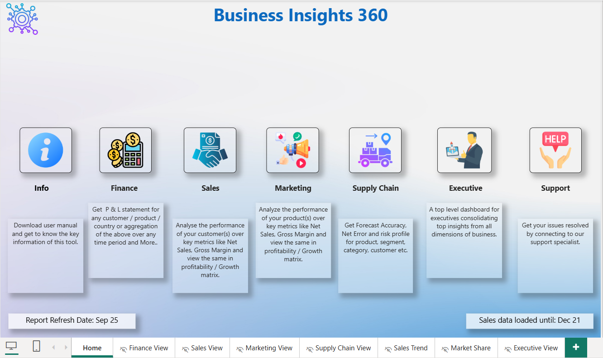
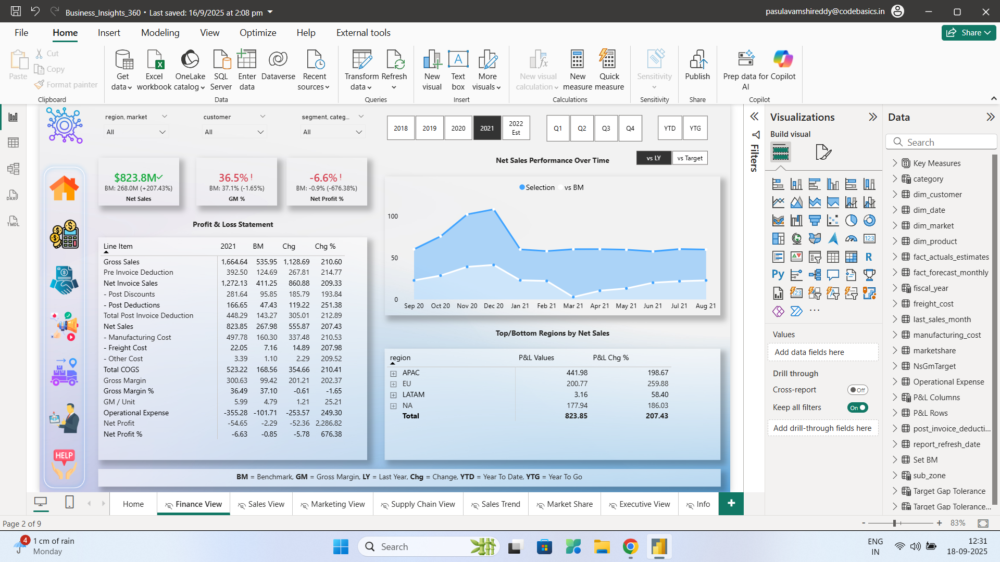
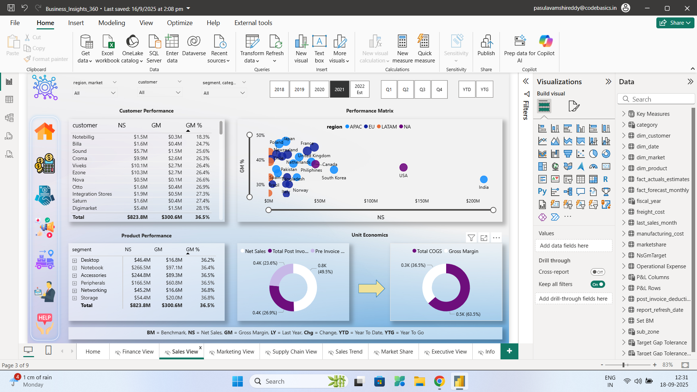
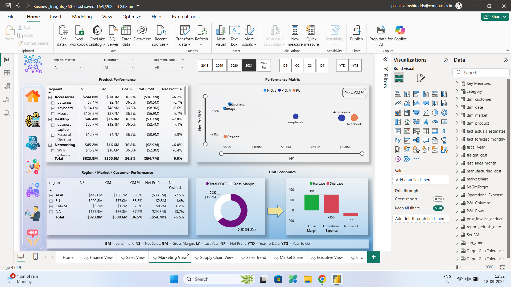
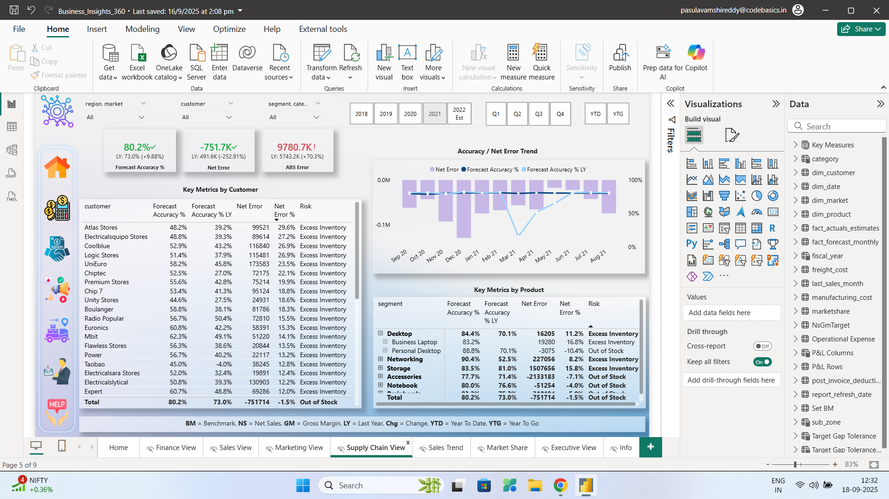
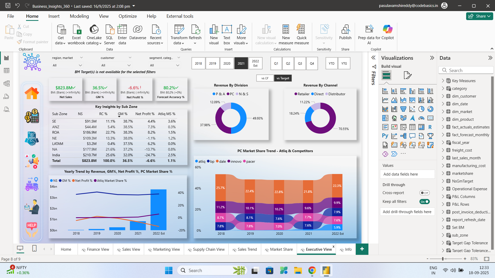

# 📊 Business Insights 360

⚡ A full-scale **Power BI Enterprise Solution** integrating **Finance, Sales, Marketing, Supply Chain, and Executive views** into a single, interactive reporting system.  
This project demonstrates **end-to-end BI development**: from SQL-based data preparation to DAX-driven KPI modeling and advanced Power BI dashboard design.

🔗 **Live Dashboard Access:**  
[▶️ View on Power BI Service](https://app.powerbi.com/view?r=eyJrIjoiOGQzY2U2OWUtODhhYS00MTRmLWJlYWItMzM0Mzg3YTdkYWNjIiwidCI6ImM2ZTU0OWIzLTVmNDUtNDAzMi1hYWU5LWQ0MjQ0ZGM1YjJjNCJ9&pageName=4a37eef28036bc358332) | [⬇️ Download .pbix File](https://github.com/vam5h1/Business-Insights-360/blob/main/Business_Insights_360.pbix?raw=true)

---

## 🎯 Business Objectives
- Break down **data silos** across Finance, Sales, Marketing, and Supply Chain  
- Deliver a **360° unified BI system** for leadership teams  
- Enable **faster, data-driven decision-making**  
- Showcase **scalable, industry-standard BI practices** for enterprise reporting  

---

## 📊 Key Metrics & Insights

### 🏠 Home View
  
- Serves as the **navigation hub** for all department dashboards  
- Provides a **snapshot of key KPIs** across the business  
- One-click navigation to detailed Finance, Sales, Marketing, Supply Chain, and Executive reports  

---

### 💰 Finance View
  
- Tracks **P&L metrics**: Revenue, Expenses, Gross Margin %, Net Profit %  
- Includes **YoY and MoM variance analysis** for financial performance monitoring  
- Helps stakeholders evaluate **profitability trends and budget alignment**  

---

### 📈 Sales View
  
- Breaks down **customer- and product-level performance**  
- Ranks **Top N products/customers dynamically** to spotlight revenue drivers  
- Contribution analysis to show which products/customers generate the most value  
- Supports **targeted sales strategy and growth planning**  

---

### 🎯 Marketing View
  
- Evaluates **campaign ROI and marketing channel effectiveness**  
- Tracks **spend vs revenue** to assess budget efficiency  
- Provides insights into **which campaigns/channels deliver the highest returns**  
- Enables **marketing optimization** and better resource allocation  

---

### 🚚 Supply Chain View
  
- Monitors **forecast accuracy, net error, and absolute error**  
- Compares **demand vs supply** to identify mismatches  
- Tracks **order variance and logistics efficiency**  
- Empowers managers to improve **demand planning and supply operations**  

---

### 🧑‍💼 Executive View
  
- Consolidates **all department KPIs** into an **executive scorecard**  
- Provides **company-wide performance trends** at a glance  
- Enables **drill-through navigation** for deeper departmental analysis  
- Tailored for **CXOs and senior decision-makers**  

---

## 📐 Data Model
- Built using a **Snowflake schema** for balance between flexibility & performance  
- **15+ relational tables** including fact and dimension tables  
- **50+ DAX measures** created for KPI logic, ratios, and trend analysis  
- Performance optimized with **DAX Studio, query folding, and indexing**  

---

## 🛠 Tools & Technologies
- **Data Sources:** SQL (MySQL), Excel, CSV (~1.8M rows)  
- **Data Prep:** Power Query (M)  
- **Data Modeling:** Snowflake schema with fact & dimension tables  
- **BI Tool:** Power BI Desktop + Service  
- **Language:** DAX (50+ measures)  
- **Optimization:** DAX Studio  
- **Automation:** Power BI Gateway with scheduled refresh  

---

## 📁 Repository Contents

| File / Folder | Description |
|---------------|-------------|
| `Business_Insights_360.pbix` | Full Power BI dashboard |
| `screenshots/` | Screenshots of each dashboard view |
| `screenshots/Home.png` | Home dashboard view |
| `screenshots/Finance_View.png` | Finance dashboard view |
| `screenshots/Sales_View.png` | Sales dashboard view |
| `screenshots/Marketing_View.png` | Marketing dashboard view |
| `screenshots/Supply-Chain_View.png` | Supply Chain dashboard view |
| `screenshots/Executive_View.png` | Executive dashboard view |

📌 *Original SQL datasets are not included due to data confidentiality agreements. Only the `.pbix` file and screenshots are provided.*

---

## 🚀 Impact
This project demonstrates how a **well-architected BI solution** can:  
- Provide **real-time, cross-department insights**  
- Standardize KPI definitions across business functions  
- Reduce reporting turnaround from weeks to **seconds**  
- Empower decision-makers with **self-service analytics**  

---

## 👨‍💻 Connect With Me  

  

🔍 Actively seeking **Data Analyst opportunities in 2025**, where I can apply my expertise in **data analysis, business intelligence, API integration, and data visualization** to help organizations turn **data into actionable insights**.  

---
